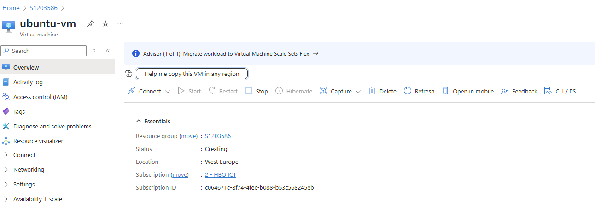

# Week 2

## 2.1 Gebruik gemaakt van deze bron om Terraform te installeren:

[Installeren van Terraform via YouTube](https://www.youtube.com/watch?v=Vt_Wd_tYFco)

Achteraf heb ik alles opnieuw moeten doen want WSL werkt niet.

Stappen van installatie gevolgd van brightspace

En ik heb AI gebruikt voor de scripts.

https://chatgpt.com/share/681cb3c0-52b4-8002-9184-8180f7d01dc2

# 2.2 Bestandenstructuur en toelichting 

🔹 variables.tf

Deze variabelen zorgen ervoor dat de configuratie makkelijk herbruikbaar is, zonder hardcoded waardes.

🔹 terraform.tfvars

In dit bestand worden de waardes toegekend aan de variabelen die zijn gedefinieerd in variables.tf.

🔹 providers.tf

In dit bestand definieer je welke cloud- of virtualisatieproviders Terraform moet gebruiken.

🔹 main.tf

In dit bestand staan de infrastructuurdefinities (VMs, netwerken, etc.)

# 2.3  Opdracht 1A  :

(ESXi) Maak een terraform manifest voor 1 Ubuntu VM met 1 vcpu en 1024MB geheugen. Je zult zien dat de VM start en dat via de remote console van ESXi een prompt kunt zien. Maar je kunt er nog niks mee… Daarom mag je de VM verwijderen. De code bewaar je wel.

Zie script in main.tf

Eindresultaat = 

#   2.3  Opdracht 1B  :
(Azure) Maak een terraform manifest voor 1 Ubuntu VM, gebaseerd op de Standard_B2ats_v2 sizing.

Zie script in main.tf

Eindresultaat = 

